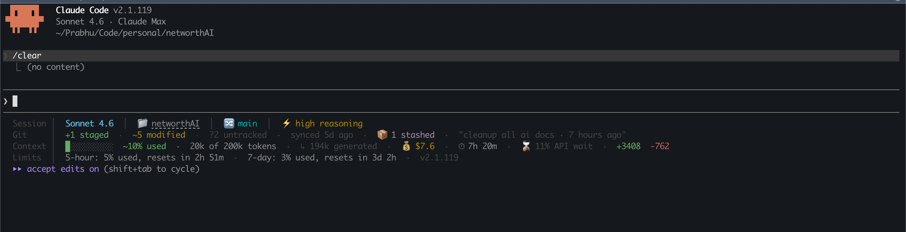

# Claude Code Setup

A personal Claude Code configuration toolkit. Each component is self-contained and installs into `~/.claude` with a single command. Currently includes a status line that replaces the default bottom bar with a richer, information-dense display.

---

## Components

| Component | Description |
|---|---|
| `statusline` | 5-row status bar showing git state, context usage, session cost, rate limits, and last message |
| `safety-gate` | PreToolUse hook that blocks destructive shell commands before they run |

---

## Installation

```bash
uvx claude-code-setup
```

Restart Claude Code after installing. The status bar appears at the bottom of the interface.

> **No `uv`?** Install it with `curl -LsSf https://astral.sh/uv/install.sh | sh`

**Install a specific component:**
```bash
uvx claude-code-setup statusline
```

**Uninstall:**
```bash
uvx claude-code-setup --uninstall
```

---

## What's included

### Status line

A 5-row bar at the bottom of Claude Code showing everything useful at a glance.



Color coding: green = healthy · amber = needs attention · red = critical.

| Row | Label | Always shown? | Content |
|---|---|---|---|
| 1 | `Session` | Yes | Model, session, directory, git branch, effort, vim mode |
| 2 | `Git` | In git repos | Staged / modified / untracked counts, ahead/behind remote, stash, last commit |
| 3 | `Context` | Yes | Context bar, token count, cache hit rate, cost, duration, API wait, lines changed |
| 4 | `Limits` | Pro/Max only | 5-hour and 7-day rate limit usage with reset countdowns, Claude Code version |
| 5 | `Message` | When available | Last user message (from transcript), truncated to 100 chars |

**See what every field means:**
```bash
uv run ~/.claude/statusline.py --help
```

---

### Safety gate

A `PreToolUse` hook that intercepts every shell command Claude runs and blocks dangerous ones before they execute.

**Blocked categories:**

| Category | Examples blocked |
|---|---|
| Git | `git push --force`, `git reset --hard`, `git clean -f`, `git branch -D`, history rewrites |
| File system | `rm -rf` on critical paths, `dd of=/dev/…`, `mkfs`, `chmod 777`, `chown -R … /` |
| Network | `curl … \| bash`, `wget … \| sh`, `eval $(curl …)`, `source <(curl …)` |
| SQL | `DROP TABLE`, `TRUNCATE`, `DELETE FROM` without WHERE, `ALTER TABLE … DROP COLUMN` |
| MongoDB | `db.dropDatabase()`, `collection.drop()` |
| Redis | `FLUSHALL`, `FLUSHDB`, `CONFIG REWRITE` |
| Elasticsearch | `DELETE /<index>` |
| Docker | `docker system prune`, bulk `rm`/`volume rm`/`network rm` via subshell |
| Kubernetes | `kubectl delete --all`, `kubectl delete namespace`, `kubectl drain` |
| Terraform | `terraform destroy`, `terraform state rm` |
| AWS | Recursive S3 delete, `ec2 terminate-instances`, `rds delete-db-instance` |
| GCP | `gcloud … delete` for projects, SQL, compute, container |
| Heroku | `heroku apps:destroy` |
| Shell | Fork bombs, `eval $(…)` |
| System | `kill -9 1`, `crontab -r`, disabling critical services via `systemctl` |

When a command is blocked, Claude sees `⛔ BLOCKED: <reason>` and must ask for explicit user approval before retrying.

---

## Development

**Set up the dev environment:**
```bash
just setup
```

**Run checks locally before committing:**
```bash
just lint      # Check code style
just format    # Auto-fix code style
just typecheck # Type checking
just test      # Run tests
just check     # Run all checks (lint + typecheck + test)
```

**Pre-commit hooks** automatically run on every commit. Install them with:
```bash
pre-commit install
```

**CI/CD** — GitHub Actions automatically runs tests and linting on every PR to `main`.
